# CareLog Aggregator

This is an attempt to create an app and plugin to aggregate and output data for DSE Carelogs.

## Installation
### Chrome Plugin 
The chrome plugin is used to add article and blogs to the reading room database.

1. Go to the [Pivotal DSE Reading Room](https://chrome.google.com/webstore/detail/pivotal-dse-reading-room/adnibniobfbbpjpcdjabmhkoeealagdb) install page 

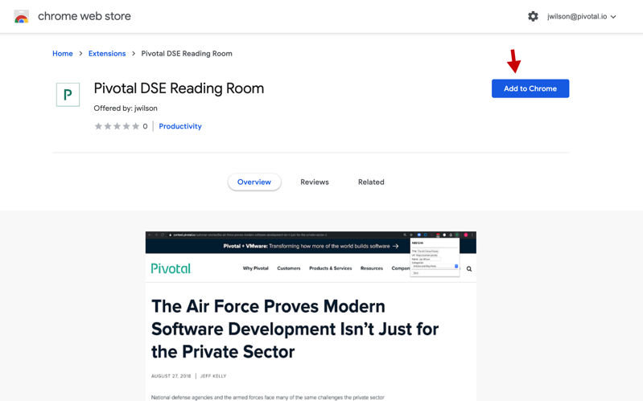

2.  Click the add to chrome button

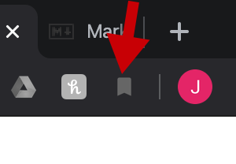

3. A new icon will be added to the upper left hand coner of your bowser

### Plugin Usage
4. Visit one of the following sites to find an article:
 - pivotal.io/blog
 - blogs.vmware.com
 - content.pivotal.io
 - pivotal.io/security
 - djavos.cfapps.io
 - starkandwayne.com/blog
 - www.brighttalk.com
 - engineering.pivotal.io
 - thenewstack.io

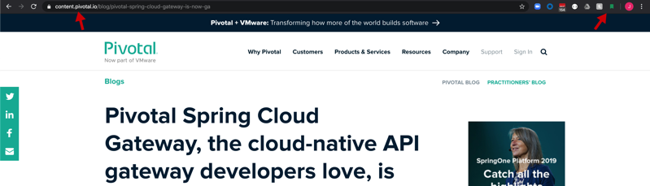

5. The icon should turn green. Select the icon. 

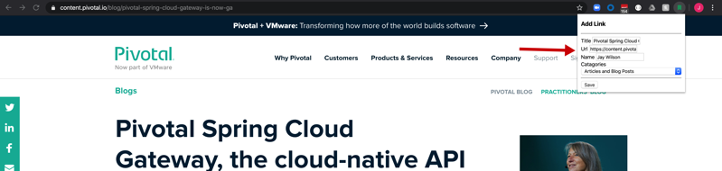

6. The save form will appear. All information should be pre-filled in. Select catagory that you want the article to appear and select save.

### Care log
7. Go to the  [Care Log Wizard](https://carelogwizzard.apps.pcfone.io/home)

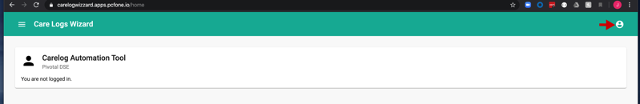

8. Click the log in icon to login to google.

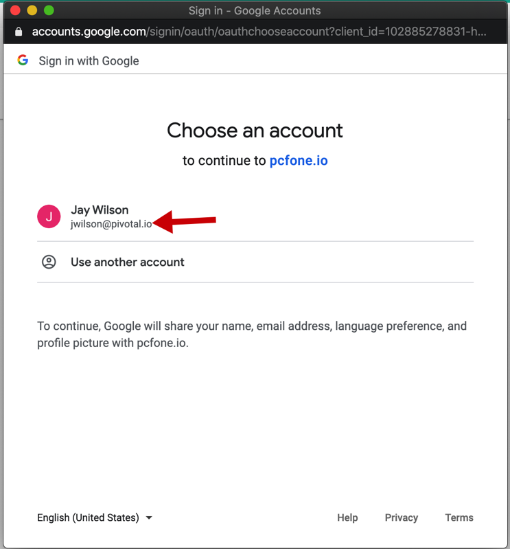

9. Log in to your pivotal account.

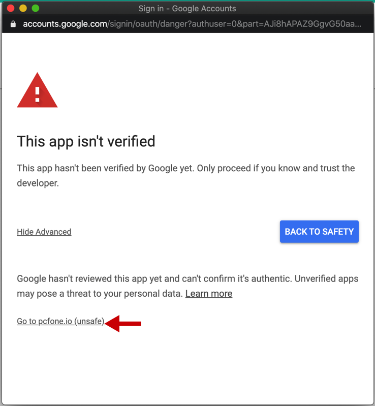

10. Click the go to pcfone for now. This should go away when he app gets verified.

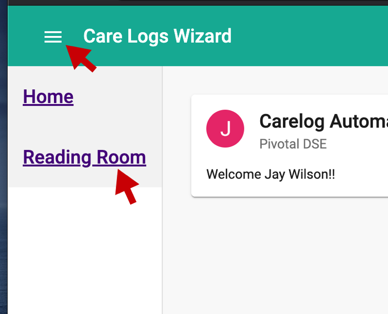

11. Click the hamburger menu and then select reading room.  

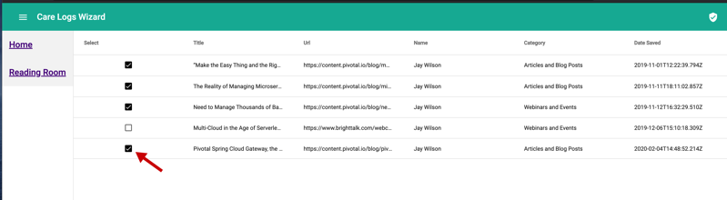

12. Select the articles you want in you reading room. 

### Export Slides

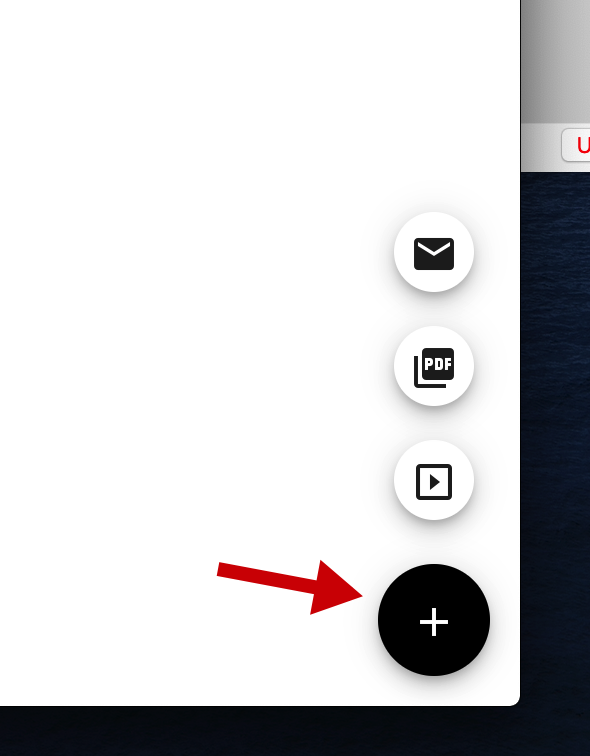

13. In the bottom right hand corner click the plus fob to show the output options. Select slides icon to generate slides.

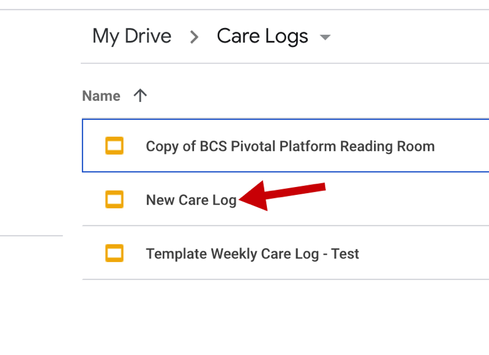

14. Open the [Carelog Folder](https://drive.google.com/open?id=1I6pYZjZM5AspBktdfjNH2GJ6309uOpda)

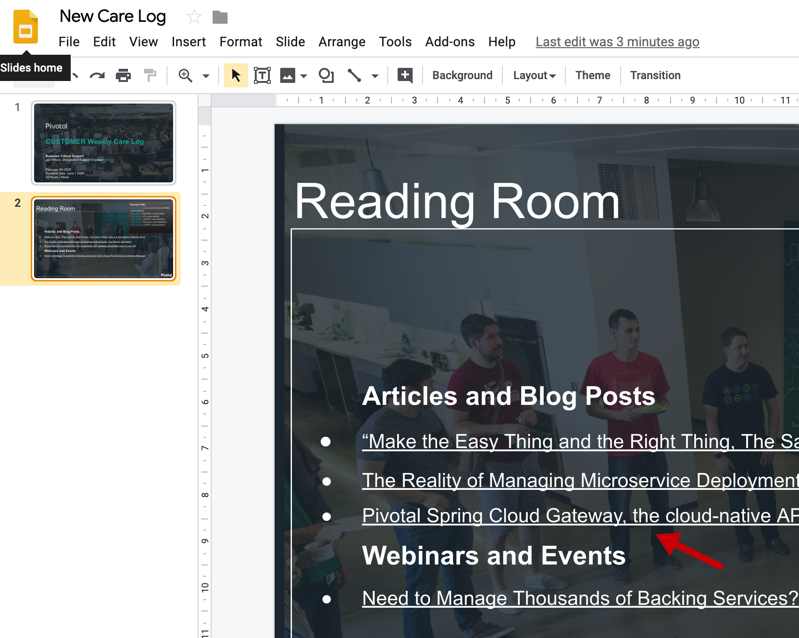

15. On the second slide you should see the article you selected

### Export to PDF

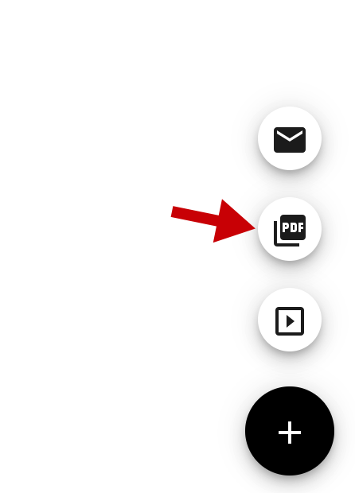

16. Click on the export pdf icon
 
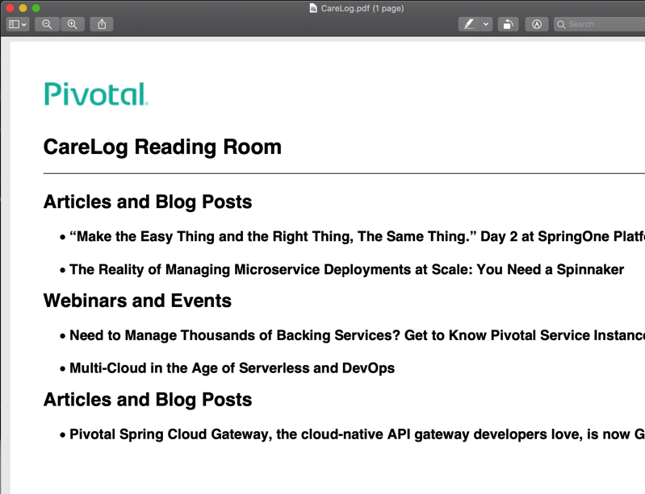

17. A pdf will be created

### Export to Draft E-mail
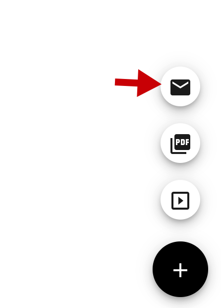

16. Click on the export pdf icon
 
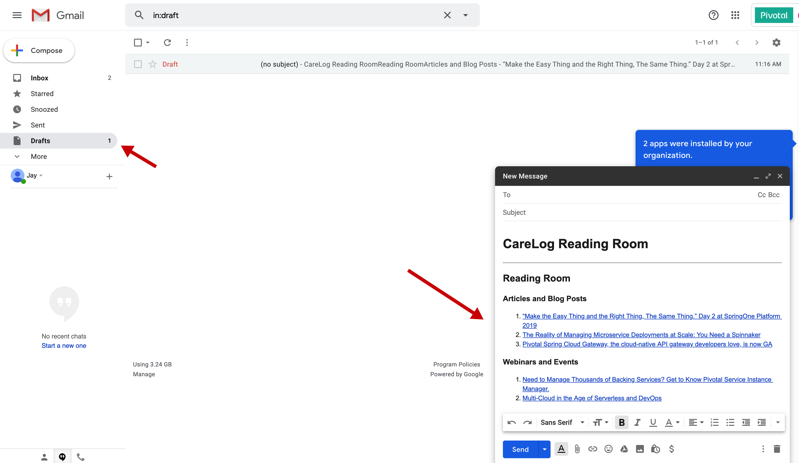

17. A draft email will be created

# Todo
- [ ] add CV's
- [ ] improve security
- [ ] modify work flow
- [ ] add abbility to approve article
- [ ] pull from salesforce
